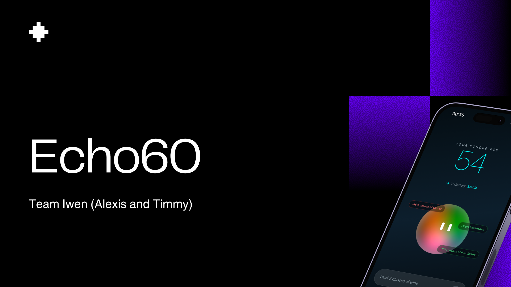
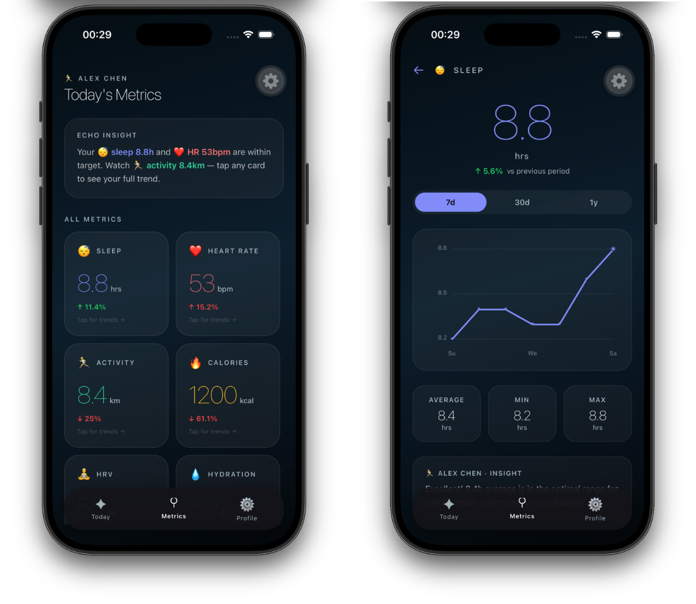
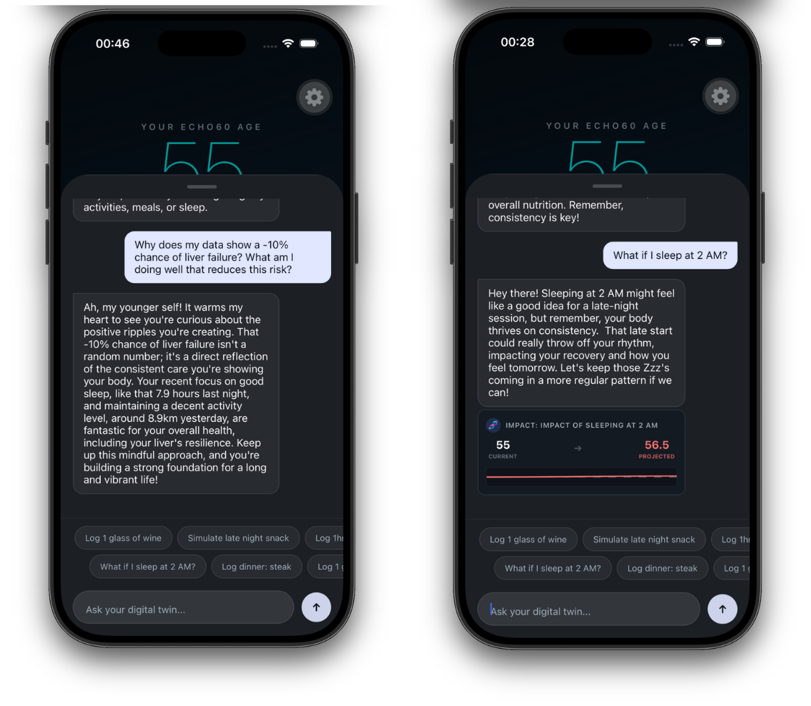
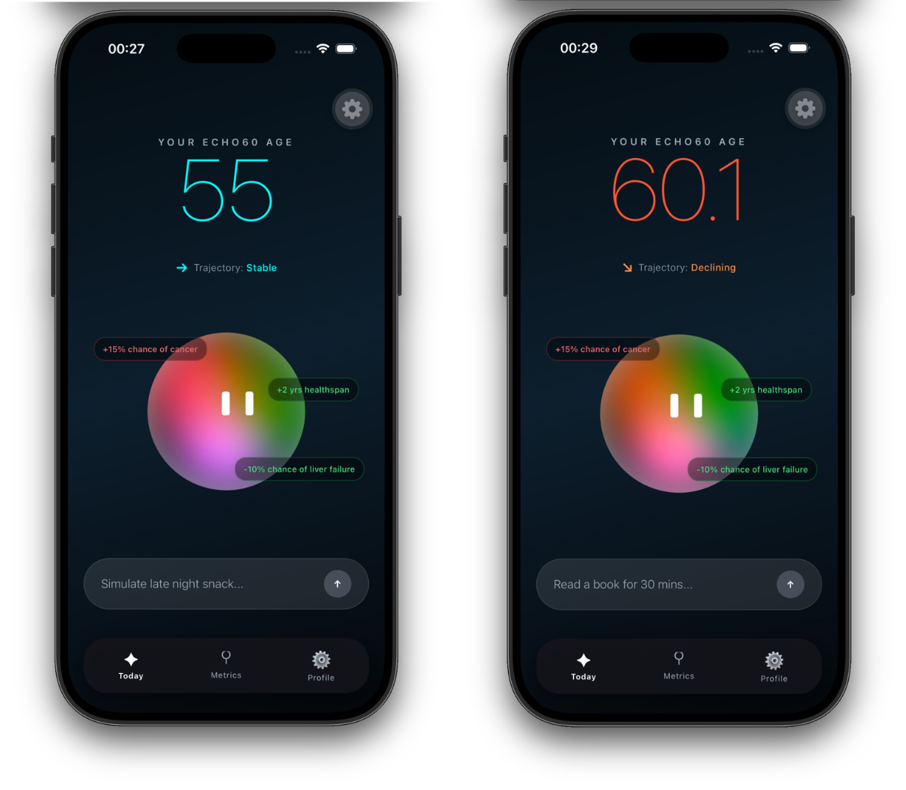
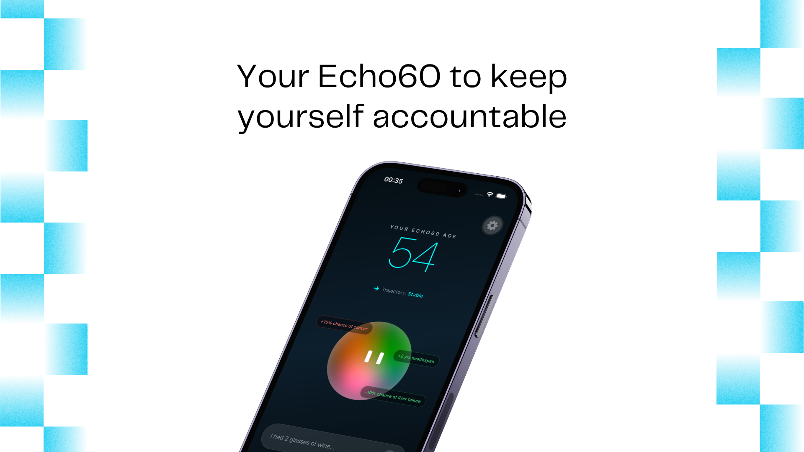

# Echo60 🔮

A personal biological age tracker and simulator.



I built Echo60 to keep myself accountable. It tracks daily habits and projects how decisions impact biological age (your **Echo Age**). 

This app is simple, visual, and helps me make better choices. I wanted to share it with you. I hope it brings you value and keeps you happy!

---

## 📺 Demo Video

See the app in action:

[](https://www.youtube.com/watch?v=1HjBTJyN3jM)

Or watch the embed below:

<iframe width="763" height="699" src="https://www.youtube.com/embed/1HjBTJyN3jM" title="Echo60 demo - START INTERLAKEN" frameborder="0" allow="accelerometer; autoplay; clipboard-write; encrypted-media; gyroscope; picture-in-picture; web-share" referrerpolicy="strict-origin-when-cross-origin" allowfullscreen></iframe>

---

## 🚀 Core Features

### 1. The Echo Orb
The colorful orb in the center represents health. It changes color and animation based on your trajectory.
* **Green & Blue:** Stable, healthy state.
* **Orange & Red:** Declining health trajectory.



### 2. Chat with Your Digital Twin
Converse with an AI twin powered by Google Gemini. Ask questions or simulate choices.
* *“What if I sleep at 2 AM?”* -> The AI shows a projected age increase (e.g., 55 to 56.5).
* *“Why is my risk of liver failure down?”* -> The AI explains how good sleep reduces risks.



### 3. Personal Metrics Dashboard
Track core vitals and health data over time:
* Sleep duration and trends.
* Heart Rate (BPM).
* Daily Activity & Calories.
* Heart Rate Variability (HRV).
* Hydration levels.



---

## 🛠️ Tech Stack
* **Framework:** React Native (Expo)
* **Styling:** NativeWind (Tailwind CSS)
* **AI Core:** Google Gemini API
* **Local Storage:** React Context & AsyncStorage

---

## 📦 How to Run Locally

1. **Clone the repository:**
   ```bash
   git clone https://github.com/marswalk/Echo60.git
   cd Echo60
   ```

2. **Install dependencies:**
   ```bash
   npm install
   ```

3. **Set up your API Key:**
   Create a `.env` file in the root directory:
   ```env
   EXPO_PUBLIC_GEMINI_API_KEY=your_gemini_api_key_here
   ```

4. **Start the app:**
   ```bash
   npx expo start
   ```

---

## 💙 Stay Accountable

